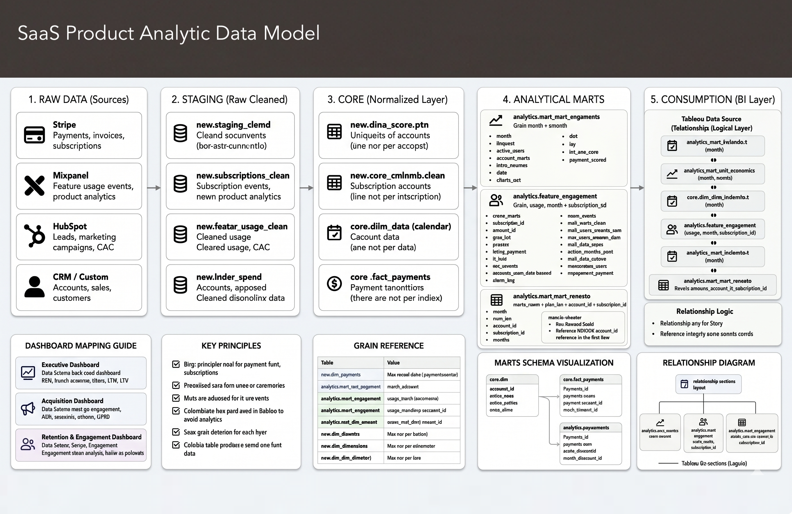
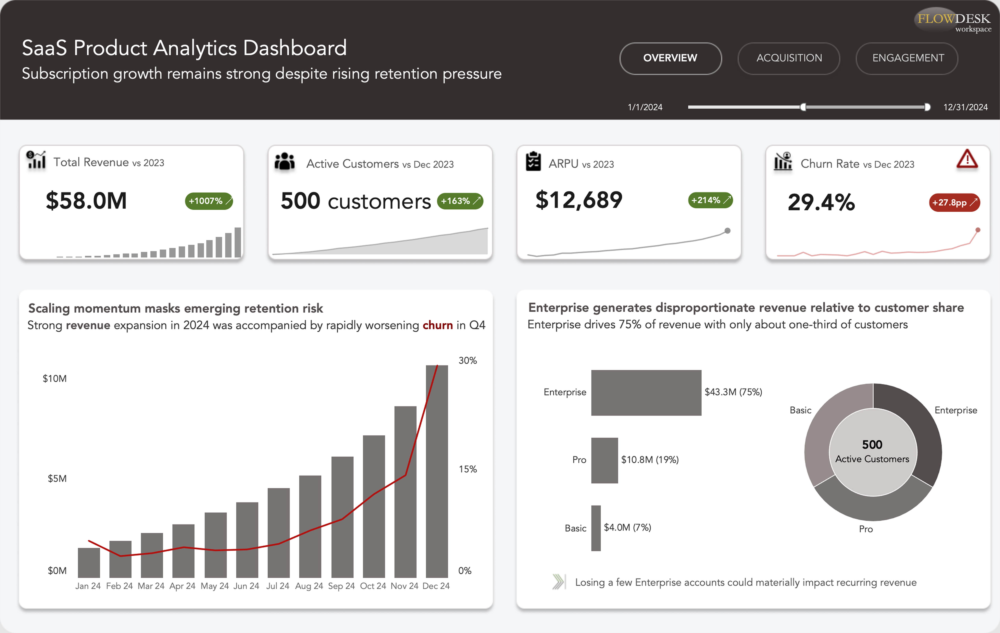
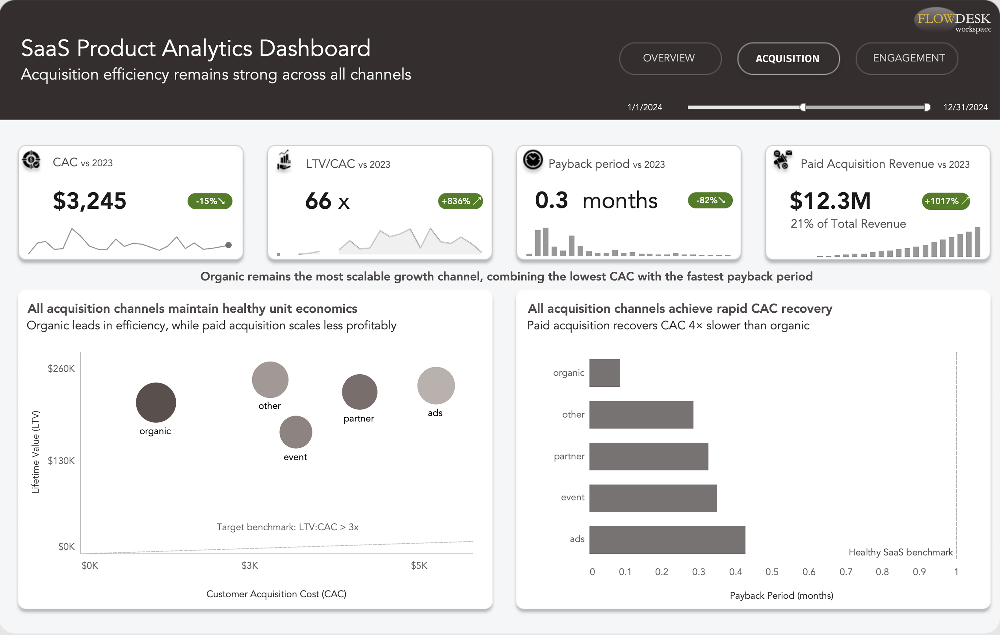
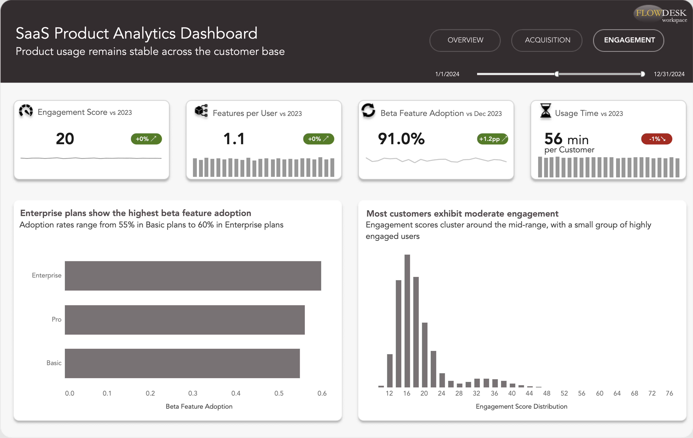

# Flowdesk Workspace: SaaS Product Analytics & Unit Economics

## I. Project Background

### Business Context

**Flowdesk Workspace** is a growing **B2B SaaS company** providing a **cloud-based productivity platform** for small businesses and enterprise customers. The company operates on a **subscription-based model**, offering **Basic, Pro, and Enterprise plans** with both monthly and annual billing options.

**Revenue growth is driven by recurring subscriptions**, while long-term business success depends on **customer retention, acquisition efficiency, product engagement, and feature adoption**.

### Key Business Questions

This analysis aims to answer the following strategic questions:

* Is the company achieving **sustainable growth** through a balance of customer acquisition, retention, and recurring revenue expansion?
* Which **customer segments** and **acquisition channels** contribute most to long-term business value and product adoption?

### Scope of Analysis

The analysis focuses on **three core business dimensions**:

1. **Business Performance & Revenue Growth**
2. **Acquisition Efficiency & Unit Economics**
3. **Product Adoption & Customer Engagement**

---

## II. Data Structure & Validation

The project analyzes a simulated SaaS subscription business using **customer, subscription, product usage, acquisition, and revenue** [data](https://www.kaggle.com/datasets/rivalytics/saas-subscription-and-churn-analytics-dataset).

### Data Model

The analytical model follows a **star-schema design** consisting of:

**Fact Tables:** Revenue Transactions, Feature Engagement, Customer Acquisition

**Dimension Tables:** Customers, Subscription Plans, Billing Frequency, Acquisition Channels, Calendar

### Data Preparation Workflow

The project follows a **complete analytics workflow** to simulate a professional BI environment:

- [Python (Pandas)](unit_economics/python): data profiling and validation, data cleaning and standardization, feature engineering and metric creation.
- [PostgreSQL](unit_economics/sql): database schema design with PK/FK constraints, analytical data mart development, and advanced SQL analysis using CTEs, Window Functions, retention calculations, revenue segmentation, and unit economics metrics.
**Key outputs include** customer retention, revenue distribution, unit economics (**LTV/CAC, payback period**), and product engagement metrics.
- [Tableau](https://public.tableau.com/app/profile/skytska/viz/ProductAnalyticsUnitEconomics/Overview): KPI development and dashboard design, interactive filtering and navigation, business storytelling and insight visualization

---

## III. Executive Summary

### Business Impact

> The analysis indicates a business with **strong and economically sustainable growth**, driven by **efficient customer acquisition, high-value Enterprise accounts, and broad product adoption**.
>
>However, the **increasing concentration of revenue within Enterprise customers**, combined with **rising churn**, highlights **retention as the most critical factor** for sustaining future growth and long-term profitability.

---

# Dashboard 1 — Overview

👉 Click the [Interactive Tableau Dashboard](https://public.tableau.com/app/profile/skytska/viz/ProductAnalyticsUnitEconomics/Overview) to explore interactive filters and drill-downs.

### Key Findings

* **Revenue grew steadily throughout 2024, reaching $10.7M.**
* **Enterprise customers contributed approximately 75% of total revenue.**
* Customer growth remained healthy across the year.
* **Churn increased significantly during Q4**, creating potential long-term revenue risk.

### Strategic Interpretation

The company demonstrates **strong monetization and customer growth**; however, increasing churn indicates that growth may become more difficult to sustain without improvements in retention.

The concentration of revenue within **Enterprise accounts** creates additional exposure, as the loss of a small number of **high-value customers** could materially impact recurring revenue.

---

# Dashboard 2 — Acquisition

👉 Click the [Interactive Tableau Dashboard](https://public.tableau.com/app/profile/skytska/viz/ProductAnalyticsUnitEconomics/Overview) to explore interactive filters and drill-downs.

### Key Findings

* **All acquisition channels achieve positive unit economics.**
* **Organic acquisition delivers the lowest CAC and highest efficiency.**
* Paid acquisition generates meaningful revenue but at a higher acquisition cost.
* **CAC payback remains below one month across all channels.**

### Strategic Interpretation

The company's growth strategy is **financially sustainable**.

**Organic acquisition** should remain a primary growth engine due to its superior efficiency, while paid acquisition should be optimized carefully to avoid diminishing returns as spend scales.

The combination of **high LTV/CAC ratios** and **rapid payback periods** indicates strong economic fundamentals.

---

# Dashboard 3 — Product Adoption & Engagement

👉 Click the [Interactive Tableau Dashboard](https://public.tableau.com/app/profile/skytska/viz/ProductAnalyticsUnitEconomics/Overview) to explore interactive filters and drill-downs.

### Key Findings

* Product engagement remains stable across customer segments.
* **Beta feature adoption exceeds 50% across all subscription plans.**
* **Enterprise plans demonstrate the highest adoption of new product functionality.**
* Most customers exhibit moderate engagement levels, while highly engaged power users represent a smaller segment of the user base.

### Strategic Interpretation

**Product adoption is broadly distributed across the customer base**, suggesting successful feature rollout and platform usability.

While engagement patterns are relatively consistent across plans, **Enterprise customers appear more willing to adopt new functionality**, potentially creating opportunities for premium feature expansion and upsell strategies.

---

## IV. Strategic Recommendations

### 1. Prioritize Enterprise Retention

**Enterprise customers generate the majority of recurring revenue.**

Recommended actions:

* Expand customer success initiatives
* Introduce churn-risk monitoring
* Conduct retention analysis on high-value accounts

### 2. Scale Efficient Acquisition Channels

**Organic acquisition consistently outperforms paid channels.**

Recommended actions:

* Increase investment in content, referrals, and partnerships
* Continuously evaluate CAC efficiency by channel
* Monitor marginal returns from paid acquisition

### 3. Expand Feature Adoption Programs

**Enterprise customers demonstrate the highest beta adoption rates.**

Recommended actions:

* Use Enterprise customers as early-adopter cohorts
* Develop structured beta testing programs
* Promote successful features to lower-tier customers

### 4. Strengthen Retention Monitoring

**Recent churn deterioration suggests emerging retention risks.**

Recommended actions:

* Establish churn monitoring dashboards
* Build customer health scoring models
* Investigate drivers behind Q4 churn increases

----

*Technical summary of tools and analytical methods used in this project*:

- Technical Stack: Python (Pandas), Jupyter Notebook, PostgreSQL, Tableau
- Analytical Methods: Data cleaning, EDA, data validation, relational data modeling, SQL aggregations, window functions, retention analysis, KPI development, dashboard design
- Key Metrics: Revenue, MRR, Customer Growth, ARPU, Churn Rate, CAC, LTV, LTV/CAC Ratio, Payback Period, Engagement Score, Feature Adoption Rate, Usage Duration
